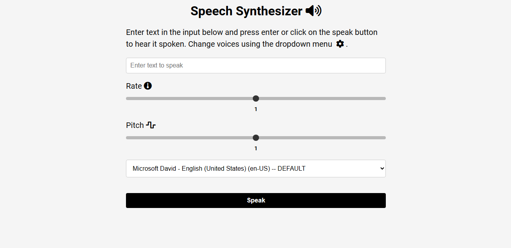

# Speech Synthesizer App

This is a simple web application that allows users to enter text and convert it into speech using the browser's built-in speech synthesis capabilities.

## App Interface

## Features

- Enter text into the input field.
- Select a voice from the available options.
- Adjust speech rate and pitch using sliders.
- Click the "Speak" button to hear the text spoken aloud.

## Technologies Used

- HTML
- CSS
- JavaScript

## Getting Started

To use the speech synthesizer app, simply open the `index.html` file in a web browser. You can also host the files on a web server for online access.

## Usage

1. Enter the text you want to convert into speech into the input field.
2. Select a voice from the dropdown menu.
3. Adjust the speech rate and pitch using the sliders if desired.
4. Click the "Speak" button to hear the text spoken aloud.

## Contributing

Contributions are welcome! If you have any suggestions, feature requests, or bug reports, please open an issue or submit a pull request.

## License

This project is licensed under the [MIT License](LICENSE).

## Acknowledgements

- Font Awesome for providing free icons.
- Browser's built-in speech synthesis capabilities.
- [MDN Web Docs](https://developer.mozilla.org/en-US/docs/Web/API/SpeechSynthesis) for documentation on the SpeechSynthesis API.
